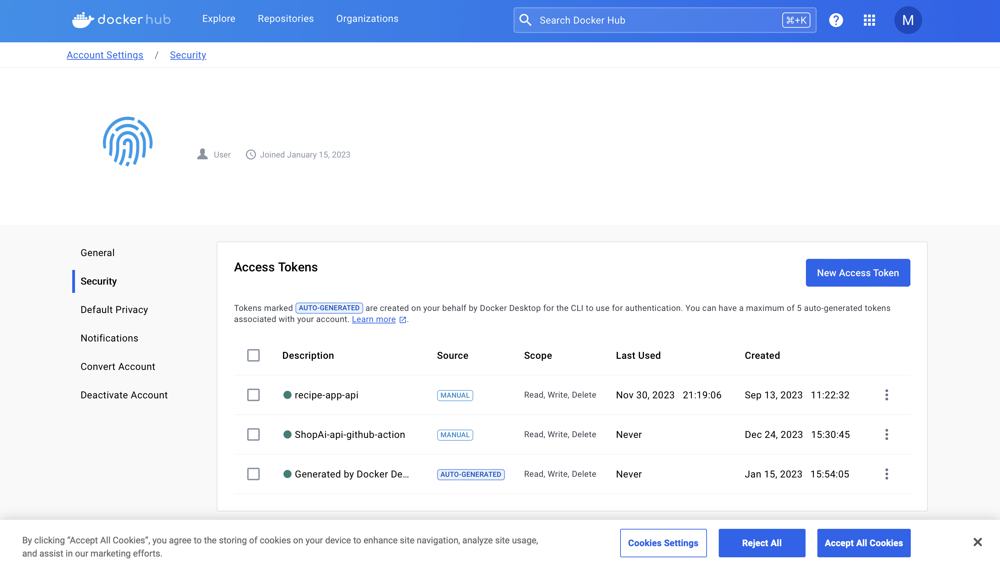
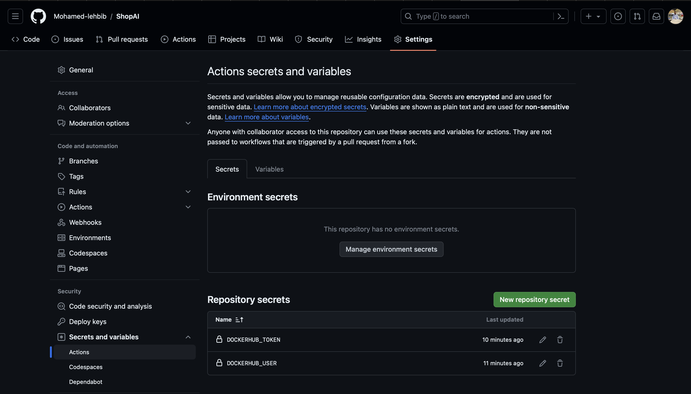

# ShopAI

It's an e-commerce app that has some AI functionalities

## SetUp of the project

- Step 1: I have created a repo on github and created a readme file and [.gitignore](.gitignore) file for python to ignore all the unnecessary files that we don't need them to be pushed to the repo.
- Step 2: I have created a [requirements.txt](requirements.txt) file that contains all the requirements that this project need to run.
- Step 3: I have created the [Dockerfile](Dockerfile) that contains the base image and the command that are going to be run and the user.

```
FROM python:3.12-alpine3.19

ENV PYTHONUNBUFFERED 1

COPY ./requirements.txt /tmp/requirements.txt
COPY ./app /app
WORKDIR /app
EXPOSE 8000

RUN python -m venv /py && \
    /py/bin/pip install --upgrade pip && \
    /py/bin/pip install -r /tmp/requirements.txt && \
    rm -rf /tmp && \
    adduser \
    --disabled-password \
    --no-create-home \
    django-user

ENV PATH="/py/bin:$PATH"

USER django-user
```

- Step 4: I have created [.dockerignore](.dockerignore) to ignore all the unnecessary files of directory to make the docker image as light as possible.
- Step 5: I have created the [app](app/) folder that will contains all the project.
- Step 5: Then to build my image I have run this command

```
docker build .
```

- Step 6: I have created a [docker-compose](docker-compose.yml) file to create the services.
- Step 7: Then I have run this command to build it

```
docker-compose build
```

- Step 8: I have created [requirements.dev.txt](requirements.dev.txt) i have added the linting package that we will use only in developement.
- Step 9: I have added this ligne in [docker-compose.yml](docker-compose.yml)

```
args:
    - DEV=true
```

- Step 10: I have added these lignes in the [Dockerfile](Dockerfile)

```
COPY ./requirements.dev.txt /tmp/requirements.dev.txt
```

and i have added this

```
ARG DEV=false
```

and i have added this in the RUN

```
if [ $DEV = "true" ]; \
    then /py/bin/pip install -r /tmp/requirements.dev.txt ; \
fi && \
```

- Step 11: Then i have rebuilded it

```
docker-compose build
```

- Step 12: I have created a [.flake8](app/.flake8) file under app that i will use to specify which files to check for linting problems.
- Step 13: I have run my linting tools to test if it's installed correctly

```
docker-compose run --rm app sh -c "flake8"
```

- Step 14: I have created the django project

```
docker-compose run --rm app sh -c "django-admin startproject app ."
```

- Step 15: I have run the project to test it

```
docker-compose up
```

- Step 16: I have created the [.github](.github) folder
- Step 17: And I have created another folder under .github [workflows](.github/workflows)
- Step 18: I have created a file under workflows [checks.yml](.github/workflows/checks.yml)
- Step 19: I have created loged in to [my dockerhub account](https://hub.docker.com) and navigated to **My account** then **security**
  
- Step 20: I have created an access token for the github action.
- Step 21: I have created a new secret in my repo
  
- Step 22: I have staged and commit and push the project on my repo and created a new tag

```
git add .
git commit -m "Version v0.0"
git tag -a v0.0 -m "Release version v0.0
git push origin main
git push origin v0.0
```

- Step 23: I have added the db service in the [docker-compose.yml](docker-compose.yml)

```
db:
    image: postgres:16-alpine
    volumes:
      - dev-db-data:/var/lib/postgresql/data
    environment:
      - POSTGRES_DB=shopAi
      - POSTGRES_USER=root
      - POSTGRES_PASSWORD=root

volumes:
  dev-db-data:

```

and I have added the name and user and pass of the db in the app service to wait for the db service to be created and started and then start the app

```
environment:
      - DB_HOST=db
      - DB_NAME=shopAi
      - DB_USER=root
      - DB_PASS=root
    depends_on:
      - db
```

Then I have tested in by running

```
docker-compose up
```

- Step 24: I have installed the postgres adaptor inside my Docker env

```
RUN python -m venv /py && \
    /py/bin/pip install --upgrade pip && \
    apk add --update --no-cache postgresql-client && \
    apk add --update --no-cache --virtual .tmp-build-deps \
    build-base postgresql-dev musl-dev && \
    /py/bin/pip install -r /tmp/requirements.txt && \
    if [ $DEV = "true" ]; \
    then /py/bin/pip install -r /tmp/requirements.dev.txt ; \
    fi && \
    rm -rf /tmp && \
    apk del .tmp-build-deps && \
    adduser \
    --disabled-password \
    --no-create-home \
    django-user
```

- Step 25: I have added the psycopg2 in [requirements.txt](requirements.txt)

```
docker-compose down
docker-compose build
```

- Step 26: I have connect my django project to the postgresql db using environment variables

```
import os
DATABASES = {
    'default': {
        'ENGINE': 'django.db.backends.postgres',
        'HOST': os.environ.get('DB_HOST'),
        'NAME': os.environ.get('DB_NAME'),
        'USER': os.environ.get('DB_USER'),
        'PASSWORD': os.environ.get('DB_PASS')

    }
}
```

- Step 27: I have created called [core](app/core)

```
docker-compose run --rm app sh -c "python manage.py startapp core"
```

- Step 28: Then i have delete the `test.py` file and `views.py` and created the [test](app/core/test) and I have created this file to initialize the folder [`__init__.py`](app/core/tests/__init__.py)
- Step 29: I have added the [core](app/core) app in the [settings.py](app/app/settings.py)
- Step 30: I have created a folder [management](app/core/management) and i have created a file under it [`__init__.py`](app/core/management/__init__.py) and I have created a folder under the management [commands](app/core/management/commands/) and a [`__init.py`](app/core/management/commands/__init__.py) file under the commands
- Step 31: I have created another file under the [commands](app/core/management/commands/) called [wait_for_db.py](app/core/management/commands/wait_for_db.py)
- Step 32: I have created a file under the [test](app/core/tests) called [test_commands.py](app/core/tests/test_commands.py)
- Step 33: I have implemented the logique for [wait_for_db.py](app/core/management/commands/wait_for_db.py) and Tested it by running

```
docker-compose run --rm app sh -c "python manage.py wait_for_db"
```

Step 34: I have added some content in the [docker-compose.yml](docker-compose.yml) to run `wait_for_db` and `migrate`

```
command: >
      sh -c "python manage.py wait_for_db &&
             python manage.py migrate &&
             python manage.py runserver 0.0.0.0:8000"
```

and run this command to test it

```
docker-compose down
docker-compose up
```

Step 35: create a test user for the model in the [test_models.py](app/core/tests/test_models.py)

```
from django.test import TestCase
from django.contrib.auth import get_user_model


class ModelTests(TestCase):
    """Test models."""

    def test_create_user_with_email_successful(self):
        """Test creating a user with an email is successful."""
        email = 'test@example.com'
        password = 'testpass123'
        user = get_user_model().objects.create_user(
            email=email,
            password=password,
        )

        self.assertEqual(user.email, email)
        self.assertTrue(user.check_password(password))
```

- Step 36: I have run the test to see if everything is working as expected

```
docker-compose run --rm app sh -c "python manage.py makemigrations"
```

- Step 37: I have create the user model in the [models.py](app/core/models.py)

```
from django.db import models
from django.contrib.auth.models import (
    AbstractBaseUser, # <-- This contains functionality for auth system but not the fields
    BaseUserManager,
    PermissionsMixin, # <-- This contains functionality for the permissions & fields
)


class User(AbstractBaseUser, PermissionsMixin):
    """User in the system."""
    email = models.EmailField(max_length=255, unique=True)
    name = models.CharField(max_length=255)
    is_active = models.BooleanField(default=True)
    is_staff = models.BooleanField(default=False)

    USERNAME_FIELD = 'email'
```

- Step 38: I have added the UserManager in the [models.py](app/core/models.py)

```
class UserManager(BaseUserManager):
    """Manager for users."""

    def create_user(self, email, password=None, **extra_fields):
        """Create, save and return a new user."""
        user = self.model(email=email, **extra_fields)
        user.set_password(password)
        user.save(using=self._db)

        return user
```

- Step 39: I have added this ligne in the [settings.py](app/app/settings.py) to specify that we are going to user model in the [core/models.py](core/models.py)

```
AUTH_USER_MODEL = 'core.User'
```

- Step 40: I have create the migrations

```
docker-compose run --rm app sh -c "python manage.py makemigrations"
```

- Step 41: I have migrated it to the database

```
docker-compose run --rm app sh -c "python manage.py wait_for_db && python manage.py migrate"
```

and I got this error when running the command

```
[+] Creating 1/0
 ✔ Container shopai-db-1  Running                                                                                       0.0s
waiting for database...
Database available!
Traceback (most recent call last):
  File "/app/manage.py", line 22, in <module>
    main()
  File "/app/manage.py", line 18, in main
    execute_from_command_line(sys.argv)
  File "/py/lib/python3.12/site-packages/django/core/management/__init__.py", line 442, in execute_from_command_line
    utility.execute()
  File "/py/lib/python3.12/site-packages/django/core/management/__init__.py", line 436, in execute
    self.fetch_command(subcommand).run_from_argv(self.argv)
  File "/py/lib/python3.12/site-packages/django/core/management/base.py", line 412, in run_from_argv
    self.execute(*args, **cmd_options)
  File "/py/lib/python3.12/site-packages/django/core/management/base.py", line 458, in execute
    output = self.handle(*args, **options)
             ^^^^^^^^^^^^^^^^^^^^^^^^^^^^^
  File "/py/lib/python3.12/site-packages/django/core/management/base.py", line 106, in wrapper
    res = handle_func(*args, **kwargs)
          ^^^^^^^^^^^^^^^^^^^^^^^^^^^^
  File "/py/lib/python3.12/site-packages/django/core/management/commands/migrate.py", line 120, in handle
    executor.loader.check_consistent_history(connection)
  File "/py/lib/python3.12/site-packages/django/db/migrations/loader.py", line 327, in check_consistent_history
    raise InconsistentMigrationHistory(
django.db.migrations.exceptions.InconsistentMigrationHistory: Migration admin.0001_initial is applied before its dependency core.0001_initial on database 'default'.
```

cuz we have unconsistent migrations history so I need to clear the data for the database

```
docker volume ls
```

to liste all the volumes on my system and then i copy the name of my volume to delete it

```
docker volume rm shopai_dev-db-data
```

And we got an error sating `Error response from daemon: No such container: shopai_dev-db-data`
it's because the volume is in use i have to stop the container

```
docker-compose down
```

Then i run the delete volume again

```
docker volume rm shopai_dev-db-data
```

So now we have cleared all the data so we can run the migrate again

```
docker-compose run --rm app sh -c "python manage.py wait_for_db && python manage.py migrate"
```

and i got another error saying:

```
[+] Creating 3/3
 ✔ Network shopai_default       Created                                                                                 0.0s
 ✔ Volume "shopai_dev-db-data"  Created                                                                                 0.0s
 ✔ Container shopai-db-1        Created                                                                                 0.0s
[+] Running 1/1
 ✔ Container shopai-db-1  Started                                                                                       0.2s
waiting for database...
Database available!
Traceback (most recent call last):
  File "/py/lib/python3.12/site-packages/django/db/backends/base/base.py", line 289, in ensure_connection
    self.connect()
  File "/py/lib/python3.12/site-packages/django/utils/asyncio.py", line 26, in inner
    return func(*args, **kwargs)
           ^^^^^^^^^^^^^^^^^^^^^
  File "/py/lib/python3.12/site-packages/django/db/backends/base/base.py", line 270, in connect
    self.connection = self.get_new_connection(conn_params)
                      ^^^^^^^^^^^^^^^^^^^^^^^^^^^^^^^^^^^^
  File "/py/lib/python3.12/site-packages/django/utils/asyncio.py", line 26, in inner
    return func(*args, **kwargs)
           ^^^^^^^^^^^^^^^^^^^^^
  File "/py/lib/python3.12/site-packages/django/db/backends/postgresql/base.py", line 275, in get_new_connection
    connection = self.Database.connect(**conn_params)
                 ^^^^^^^^^^^^^^^^^^^^^^^^^^^^^^^^^^^^
  File "/py/lib/python3.12/site-packages/psycopg2/__init__.py", line 122, in connect
    conn = _connect(dsn, connection_factory=connection_factory, **kwasync)
           ^^^^^^^^^^^^^^^^^^^^^^^^^^^^^^^^^^^^^^^^^^^^^^^^^^^^^^^^^^^^^^^
psycopg2.OperationalError: connection to server at "db" (192.168.16.2), port 5432 failed: Connection refused
        Is the server running on that host and accepting TCP/IP connections?


The above exception was the direct cause of the following exception:

Traceback (most recent call last):
  File "/app/manage.py", line 22, in <module>
    main()
  File "/app/manage.py", line 18, in main
    execute_from_command_line(sys.argv)
  File "/py/lib/python3.12/site-packages/django/core/management/__init__.py", line 442, in execute_from_command_line
    utility.execute()
  File "/py/lib/python3.12/site-packages/django/core/management/__init__.py", line 436, in execute
    self.fetch_command(subcommand).run_from_argv(self.argv)
  File "/py/lib/python3.12/site-packages/django/core/management/base.py", line 412, in run_from_argv
    self.execute(*args, **cmd_options)
  File "/py/lib/python3.12/site-packages/django/core/management/base.py", line 458, in execute
    output = self.handle(*args, **options)
             ^^^^^^^^^^^^^^^^^^^^^^^^^^^^^
  File "/py/lib/python3.12/site-packages/django/core/management/base.py", line 106, in wrapper
    res = handle_func(*args, **kwargs)
          ^^^^^^^^^^^^^^^^^^^^^^^^^^^^
  File "/py/lib/python3.12/site-packages/django/core/management/commands/migrate.py", line 117, in handle
    executor = MigrationExecutor(connection, self.migration_progress_callback)
               ^^^^^^^^^^^^^^^^^^^^^^^^^^^^^^^^^^^^^^^^^^^^^^^^^^^^^^^^^^^^^^^
  File "/py/lib/python3.12/site-packages/django/db/migrations/executor.py", line 18, in __init__
    self.loader = MigrationLoader(self.connection)
                  ^^^^^^^^^^^^^^^^^^^^^^^^^^^^^^^^
  File "/py/lib/python3.12/site-packages/django/db/migrations/loader.py", line 58, in __init__
    self.build_graph()
  File "/py/lib/python3.12/site-packages/django/db/migrations/loader.py", line 235, in build_graph
    self.applied_migrations = recorder.applied_migrations()
                              ^^^^^^^^^^^^^^^^^^^^^^^^^^^^^
  File "/py/lib/python3.12/site-packages/django/db/migrations/recorder.py", line 81, in applied_migrations
    if self.has_table():
       ^^^^^^^^^^^^^^^^
  File "/py/lib/python3.12/site-packages/django/db/migrations/recorder.py", line 57, in has_table
    with self.connection.cursor() as cursor:
         ^^^^^^^^^^^^^^^^^^^^^^^^
  File "/py/lib/python3.12/site-packages/django/utils/asyncio.py", line 26, in inner
    return func(*args, **kwargs)
           ^^^^^^^^^^^^^^^^^^^^^
  File "/py/lib/python3.12/site-packages/django/db/backends/base/base.py", line 330, in cursor
    return self._cursor()
           ^^^^^^^^^^^^^^
  File "/py/lib/python3.12/site-packages/django/db/backends/base/base.py", line 306, in _cursor
    self.ensure_connection()
  File "/py/lib/python3.12/site-packages/django/utils/asyncio.py", line 26, in inner
    return func(*args, **kwargs)
           ^^^^^^^^^^^^^^^^^^^^^
  File "/py/lib/python3.12/site-packages/django/db/backends/base/base.py", line 288, in ensure_connection
    with self.wrap_database_errors:
  File "/py/lib/python3.12/site-packages/django/db/utils.py", line 91, in __exit__
    raise dj_exc_value.with_traceback(traceback) from exc_value
  File "/py/lib/python3.12/site-packages/django/db/backends/base/base.py", line 289, in ensure_connection
    self.connect()
  File "/py/lib/python3.12/site-packages/django/utils/asyncio.py", line 26, in inner
    return func(*args, **kwargs)
           ^^^^^^^^^^^^^^^^^^^^^
  File "/py/lib/python3.12/site-packages/django/db/backends/base/base.py", line 270, in connect
    self.connection = self.get_new_connection(conn_params)
                      ^^^^^^^^^^^^^^^^^^^^^^^^^^^^^^^^^^^^
  File "/py/lib/python3.12/site-packages/django/utils/asyncio.py", line 26, in inner
    return func(*args, **kwargs)
           ^^^^^^^^^^^^^^^^^^^^^
  File "/py/lib/python3.12/site-packages/django/db/backends/postgresql/base.py", line 275, in get_new_connection
    connection = self.Database.connect(**conn_params)
                 ^^^^^^^^^^^^^^^^^^^^^^^^^^^^^^^^^^^^
  File "/py/lib/python3.12/site-packages/psycopg2/__init__.py", line 122, in connect
    conn = _connect(dsn, connection_factory=connection_factory, **kwasync)
           ^^^^^^^^^^^^^^^^^^^^^^^^^^^^^^^^^^^^^^^^^^^^^^^^^^^^^^^^^^^^^^^
django.db.utils.OperationalError: connection to server at "db" (192.168.16.2), port 5432 failed: Connection refused
        Is the server running on that host and accepting TCP/IP connections?
```

and

```
docker-compose build
```

to build the service and **rerun it and it will work**

## Psycopg2

### Required packages

- C compiler
- python3-dev
- libpq-dev

### Equivalent of the required packages for Alpine

- postgresql-client
- build-base
- postgresql-dev
- musl-dev

### Docker cleanup

`build-base`, `postgresql-dev` and `musl-dev` are only need to install the psycopg2 so after install the package we will delete them to keep our Docker file very minimal.
